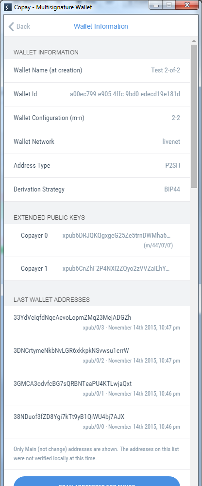

Generating Bitcoin addresses from HDM Public keys
=================================================

This repository describes creating public Bitcoin addresses based on multiple
extended public keys of a HDM wallet, as in the following Copay config:



Requirements
------------

The [pybitcointools](https://github.com/vbuterin/pybitcointools) library.

```bash
$ pip install git://github.com/vbuterin/pybitcointools.git@bce500e154523f78912365d9e3b51d34589831a3#egg=pybitcointools
```

Example script
-------------------------------

The file `copaygen.py` contains an example script that opens the localstorage
file generated by Copay and generates public addresses based on that. Example
usage:

    # Open default copay profile and generate 100 public addresses
    # If there's more than one wallet, ask for the details interactively
    $ python copaygen.py

    # Generate addresses from 100 to 150
    $ python copaygen.py -s 100 -n 150

    # Open the wallet with id a00ec799-e905-4ffc- 9bd0-edecd19e181d<
    $ python copaygen.py --walletid=a00ec799-e905-4ffc-9bd0-edecd19e181d

    # Specify the path to Copay's localstorage file
    $ python copaygen.py --localstorage=~/copay/Local\ Storage/file__0.localstorage

Run `python copaygen.py -h` for more info.

The script uses the pybitcointools library, described as follows:

Generation using pybitcointools
-------------------------------

The gist of the code is the `bip32_hdm_addr` function from the pybitcointools
library, which is used like this:

    bip32_hdm_addr
        <list of extended pubkeys>,
        <number of required pubkeys (the m in m-of-n)>,
        <derivation path as list>
    )

Note that the first and third arguments must be given as lists (tuples or other
iterables won't do!)

So for an example, to generate the first public address that Copay would
generate for a 2-of-2 HDM wallet with the extended public keys stored in
variables pub1 and pub2, we would call the function as follows:

    >>> bip32_hdm_addr([pub1, pub2], 2, [0,0])
    '3GMCA3odvfcBG7sQRBNTeaPU4KTLwjaQxt'

Note that Copay seems to always derive the addresses from path 0/i, where i is
the current derivation iteration. As such, the following keys would be
generated like this:

    >>> bip32_hdm_addr([pub1, pub2], 2, [0,1])
    >>> bip32_hdm_addr([pub1, pub2], 2, [0,2])
    >>> bip32_hdm_addr([pub1, pub2], 2, [0,3])
    >>> bip32_hdm_addr([pub1, pub2], 2, [0,4])

And so on.
